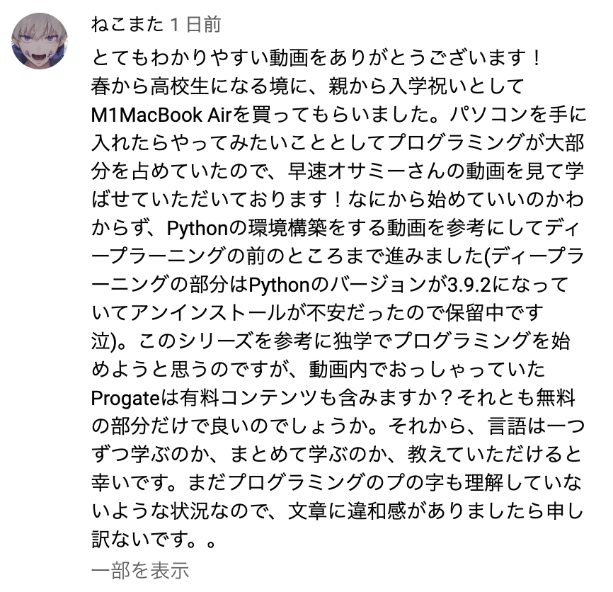

## 高校1年生からの質問回答
- 高校生になったばかりの方から質問いただいた
- 「Progate有料コンテンツもやったほうがいいのか？」
- 「プログラミング言語は一つずつ学んだ方がいいのか？」
##
##
##
##
##

---

### 前提
- 質問者は高校生1年生(16歳?).
  - 社会人になるまであと7年近くあり、時間がある
##### なので 今回は 
# 大部分の人は参考になりませんのでご注意ください
###### しかも
### 今回は　オサミーの思想が強めです
- チャンネル登録者数が減りそう🤔
- だけど言いたいこといいます🤔
##

---

## 結論: この動画であなたに伝えたいこと
- 「夢は大きく 視座高く」
  - 寄り道をたくさんしよう
  - ハマることを探して, とことんハマろう
###
###
###
###
###
###
###
###

---

## Sub結論
- Progateの有料コンテンツは お金に余裕があればやればいい
  - マストではない
  - どんどん次いこうぜ
  - ハマるもの探しに行こうぜ
- プログラミング言語は「ひとつずつ学ぶ」でOK! 
  - ただし言語にこだわる必要なし. あくまで手段. なんでもよい.

### 細かいこと気にしないでどんどん進んでいこうぜ💪
##
##
##

---

## 夢は大きく 視座高く
- オサミーからの願いは **「小さくまとまらないでほしい」**
  - 自社開発企業に就職するための学習**だけ**とかやめてほしい
  - **色々トライしてほしい**
- 普段のオサミーの動画は、あんまり見なくてよい. 
  - 参考にならないので.
- というのも、このチャンネルの動画は...
##
##
##
##
##

---
###### 夢は大きく 視座高く
## オサミーのYouTube動画は誰向けか？
 
- オサミーの普段の動画は、エンジニアになりたい人やプログラミング興味ある人向け
  - 大学生20歳〜社会人35歳 向け
  - メイン→30歳前後 向け
    - 転職できるギリギリな年齢, 焦り始めてる
- 「70万円払わずにエンジニアになる方法 」シリーズ
  - 30歳前後の人が、未経験から
  - 最短距離でソフトウェアエンジニアになるための方法
  - つまり***高校生向けではない***
##
##

---

###### 夢は大きく 視座高く
## 高校生は違う
- 圧倒的に 「時間」がある
  - 寄り道ができる
  - 人生=冒険
  - 冒険の面白いところは「寄り道」
- オサミーからの願い：「寄り道」をたくさんしてほしい
  - 寄り道に自分が面白いと思える”宝”がある!
  - 宝(ハマること)を探しに行こう!
##
##
##

---
###### 夢は大きく 視座高く
## 寄り道とは =本筋(教材)と違う道
### 寄り道サンプル1
- コンピューターに興味あるなら
  - [CPU](https://ja.wikipedia.org/wiki/CPU)を自分でつくってもよし: 自作CPU
  - [OS](https://ja.wikipedia.org/wiki/%E3%82%AA%E3%83%9A%E3%83%AC%E3%83%BC%E3%83%86%E3%82%A3%E3%83%B3%E3%82%B0%E3%82%B7%E3%82%B9%E3%83%86%E3%83%A0)を自分でつくってもよし: 自作OS
- インターネットに興味あるなら
  - 歴史を学ぶもよし インターネットの歴史([JPNIC](https://www.nic.ad.jp/timeline/),[wikipedia](https://ja.wikipedia.org/wiki/%E3%82%A4%E3%83%B3%E3%82%BF%E3%83%BC%E3%83%8D%E3%83%83%E3%83%88%E3%81%AE%E6%AD%B4%E5%8F%B2)), [ARPANET](https://ja.wikipedia.org/wiki/ARPANET)
  - [TCP/IP](https://ja.wikipedia.org/wiki/%E3%82%A4%E3%83%B3%E3%82%BF%E3%83%BC%E3%83%8D%E3%83%83%E3%83%88%E3%83%BB%E3%83%97%E3%83%AD%E3%83%88%E3%82%B3%E3%83%AB%E3%83%BB%E3%82%B9%E3%82%A4%E3%83%BC%E3%83%88)を学ぶもよし
##
##
##
---
###### 夢は大きく 視座高く
### 寄り道サンプル2:世界を変えるサービスに興味があるなら
- アメリカの[シリコンバレー](https://ja.wikipedia.org/wiki/%E3%82%B7%E3%83%AA%E3%82%B3%E3%83%B3%E3%83%90%E3%83%AC%E3%83%BC)に行ってもよし
- プログラマーの偉人を学ぶのもよし
    - [リーナス・トーバルズ](https://ja.wikipedia.org/wiki/%E3%83%AA%E3%83%BC%E3%83%8A%E3%82%B9%E3%83%BB%E3%83%88%E3%83%BC%E3%83%90%E3%83%AB%E3%82%BA) , [ポール・グレアム](https://ja.wikipedia.org/wiki/%E3%83%9D%E3%83%BC%E3%83%AB%E3%83%BB%E3%82%B0%E3%83%AC%E3%82%A2%E3%83%A0) ([エッセイはこちら](http://practical-scheme.net/wiliki/wiliki.cgi?naoya_t%3A%E3%83%9D%E3%83%BC%E3%83%AB%E3%83%BB%E3%82%B0%E3%83%AC%E3%82%A2%E3%83%A0%E3%81%AE%E3%82%A8%E3%83%83%E3%82%BB%E3%82%A4%E3%81%A8%E5%92%8C%E8%A8%B3%E4%B8%80%E8%A6%A7)) 
    - [ヴィタリック・ブテリン](https://ja.wikipedia.org/wiki/%E3%83%B4%E3%82%A3%E3%82%BF%E3%83%AA%E3%83%83%E3%82%AF%E3%83%BB%E3%83%96%E3%83%86%E3%83%AA%E3%83%B3)
- 起業家/投資家の偉人を学ぶのもよし
    - [マーク・アンドリーセン](https://ja.wikipedia.org/wiki/%E3%83%9E%E3%83%BC%E3%82%AF%E3%83%BB%E3%82%A2%E3%83%B3%E3%83%89%E3%83%AA%E3%83%BC%E3%82%BB%E3%83%B3), [ピーター・ティール](https://ja.wikipedia.org/wiki/%E3%83%94%E3%83%BC%E3%82%BF%E3%83%BC%E3%83%BB%E3%83%86%E3%82%A3%E3%83%BC%E3%83%AB) 
    - [ビル・ゲイツ](https://ja.wikipedia.org/wiki/%E3%83%93%E3%83%AB%E3%83%BB%E3%82%B2%E3%82%A4%E3%83%84), [スティーブ・ジョブズ](https://ja.wikipedia.org/wiki/%E3%82%B9%E3%83%86%E3%82%A3%E3%83%BC%E3%83%96%E3%83%BB%E3%82%B8%E3%83%A7%E3%83%96%E3%82%BA)
    - [イーロン・マスク](https://en.wikipedia.org/wiki/Elon_Musk), [ジャック・ドーシー](https://en.wikipedia.org/wiki/Jack_Dorsey)
##
##
##
---

### てか...
### 🤔なぜプログラミングに興味を持ったのだろう？
- コメントください
  - まこなり社長？他YouTube？
  - 一般的なニュース（プログラミング教育が必須へ）とか？
##
##
##
##
##

---
### 寄り道サンプル3

- ゲーム好きなら
  - ゲーム廃人になるのもよし, ゲーム配信者になるのもよし 
  - eスポーツで世界大会目指してもよし
     - 例)[Dota2](https://ja.wikipedia.org/wiki/Dota_2), [Fortnite](https://ja.wikipedia.org/wiki/%E3%83%95%E3%82%A9%E3%83%BC%E3%83%88%E3%83%8A%E3%82%A4%E3%83%88_(%E3%82%B2%E3%83%BC%E3%83%A0)), [League of Legends](https://ja.wikipedia.org/wiki/League_of_Legends), スマブラ, ストリートファイター
- 新しい「金融」「通貨」に興味あるなら
  - [Bitcoin](https://ja.wikipedia.org/wiki/%E3%83%93%E3%83%83%E3%83%88%E3%82%B3%E3%82%A4%E3%83%B3)の[サトシナカモト](https://ja.wikipedia.org/wiki/%E3%82%B5%E3%83%88%E3%82%B7%E3%83%BB%E3%83%8A%E3%82%AB%E3%83%A2%E3%83%88)の論文読んでもいいし,マイニングしてもいいし, 
  - [イーサリアム](https://ja.wikipedia.org/wiki/%E3%82%A4%E3%83%BC%E3%82%B5%E3%83%AA%E3%82%A2%E3%83%A0)勉強してもいい
  - [DiFi](https://ja.wikipedia.org/wiki/DeFi)勉強してもいいし, [DApps](https://en.wikipedia.org/wiki/Decentralized_application)作っても良い
  - [NFT](https://ja.wikipedia.org/wiki/%E9%9D%9E%E4%BB%A3%E6%9B%BF%E6%80%A7%E3%83%88%E3%83%BC%E3%82%AF%E3%83%B3)として何か売り出してもいい 
- プログラミング言語として一般的に勧められてないものもやってもよい
  - 高級言語: [C](https://ja.wikipedia.org/wiki/C%E8%A8%80%E8%AA%9E), [C++](https://ja.wikipedia.org/wiki/C%2B%2B), [Perl](https://ja.wikipedia.org/wiki/Perl), [Rust](https://ja.wikipedia.org/wiki/Rust_(%E3%83%97%E3%83%AD%E3%82%B0%E3%83%A9%E3%83%9F%E3%83%B3%E3%82%B0%E8%A8%80%E8%AA%9E)) 
  - 低級言語:[アセンブリ言語](https://ja.wikipedia.org/wiki/%E3%82%A2%E3%82%BB%E3%83%B3%E3%83%96%E3%83%AA%E8%A8%80%E8%AA%9E)
##
---

## 興味があったら調べてみてね
- キーワードをたくさん挙げてみた.
  - 自作OS, 自作CPU, ARPANET, マーク・アンドリーセン, Bitcoin, NFT, DiFi...
- **この資料を, この動画の概要欄に貼っておくから興味あったら見てみてね**
  - Wikipediaのリンク集になってるよ
  - Wikipedia巡るだけでも結構知識になるぞ
- 他 気になったキーワードをGoogle検索してみてね
  - インターネットの海は広いぞ
### テクノロジーは面白いぞ...! プログラミングで世界は面白くできる..!

##
##
##
##

---

###### 夢は大きく 視座高く
## 寄り道がもっと面白くなる武器3選〜学校で学べること〜
- 英語 (最もおすすめ)
  - 英語学べばもっと世界は広くなって面白くなるよ
    - 日本語情報に比較して 情報量が5〜10倍違う
- 数学
  - 微分積分や行列とかできたほうが機械学習などの分野で面白さ倍増
  - 数Ⅱ（数列やベクトルetc.）はマスト
  - できれば高校数学の数Ⅲ（微分積分）と数C（行列）までやっておいて
- 物理
  - オームの法則や運動量保存の法則などの..
    - 原理原則を知ってるものは強い
  - 高校物理のおすすめ本→『物理のエッセンス』[1](https://amzn.to/3mqbQDy), [2](https://amzn.to/3rWXuf7)

#### (🤔問題意識:英語できないエンジニア多すぎ..)

--- 
###### 脱線します.
## 🤔オサミーの問題意識①〜ソフトウェアエンジニアとして〜
多くの人に響かないのは知ってるけど言わせて
### CSの基礎力つけないと日本のエンジニアやばいかも
- 未経験からソフトウェアエンジニアになれるのは日本だけ？(日本甘すぎ)
- 少なくとも海外はCS学位(or同等なもの)がマスト
- 基本情報技術者試験くらいの知識は持っていないと
- アジアの優秀なエンジニアに仕事が奪われる!?
  - いまは日本語の壁のおかげでなんとかなってるけど..
##
##
##
---
###### 脱線します.
### 長期的にエンジニアとして成功したいのならCSの知識はつけておくべし
- 他エンジニア系YouTuberが言ってないから言わしてもらうわ
  - ある意味 オサミーがYouTuberをやる理由のひとつ(使命, ミッション)
- たまたまこの10年(2010年代)スマホシフトという超ビックウェーブに乗れて
  - うまくいった輩(自分含む)が ウダウダ意見を言ってるのが YouTube界.
  - これから先は, ビジネスチャンスが過去10年に比べて小さくなってるので
    - 基礎力がないとエンジニア競争に勝てないぞ
###### ソフトウェアエンジニアとして長期的に成功したいなら...
## コンピューターサイエンスやっとけ！ 
### 　　　by オサミー
##

---
###### 脱線します.
## 🤔エンジニアYouTuberとしてのジレンマ(愚痴)
### 下記どのテーマが 一番 視聴回数が伸びるでしょうか？
- ①「コンピューターサイエンスやろうぜ」
  - 長期的にITエンジニアとして成功するために必要だから
- ②「Reactでポートフォリオつくろうぜ」
  - ITエンジニア就職に必要だから
- ③「アイリスオオヤマ発表のノートPCはク◯すぎる」
  - 消費者に損しないでほしいから
##
##
##

---

###### 脱線します.
## YouTubeは..
- 「すぐ役に立つ系」「損しないためには系」がView数 伸びる
- というか、それしか伸びない

### 長期的に成功するためには 
- 情報収集は、やっぱ「本」がいいよ.
  - YouTubeは娯楽でしかない
- YouTubeは、閉じよう
  - もしどうしても見たいなら
  - チャンネル登録は[ヨビノリさん](https://www.youtube.com/channel/UCqmWJJolqAgjIdLqK3zD1QQ)と、オサミーだけ！
##
##

---
## コンピューターサイエンスを学べるおすすめ本①
- [『CPUの造り方』渡波郁 ](https://amzn.to/3wy8vXN)
  - CPUの設計が自作しながらわかる. 平易な言葉で書かれてるので安心
  - CPU自作経験は財産になる(オサミーは持ってない)
- [『30日でできる! OS自作入門 』川合秀実](https://amzn.to/2PY2DWA)
  - アセンブラとC言語でOSつくる! こちらも平易な言葉で書かれてる
  - プログラミングとは=機械を操作するもの, を実感できる
  - OS自作経験は財産になるしリスペクトされる(もちろんオサミーは略)

※ オサミーもCS学位もってないからそれなりに焦りがある
 最近↑2冊買って勉強してる(遅い)
##
##
##

---
## コンピューターサイエンスを学べるおすすめ本②
- [『マスタリングTCP/IP―入門編―(第6版)』井上直也 他](https://amzn.to/3wq4swn)
  - コンピューターネットワークの基礎を学べる. プロトコルとか
  - 先人の偉大さを知る. 「仕組みつくった人すげぇ！」
  - 仕組み(ルール)づくり側にまわりたかったらTCP/IPはマスト
- [『Webを支える技術-HTTP、URI、HTML、そしてREST』山本陽平](https://amzn.to/3rOQ3pS)
  - Webとは〜Webの歴史〜APIの設計(ただしRESTのみ)が学べる
  - 本来は[REST](https://ja.wikipedia.org/wiki/Representational_State_Transfer)だけでなく, [gRPC](https://ja.wikipedia.org/wiki/GRPC), [GraphQL](https://ja.wikipedia.org/wiki/GraphQL)も抑えるべし
  - [HTTP/2](https://ja.wikipedia.org/wiki/HTTP/2) , [HTML5](https://ja.wikipedia.org/wiki/HTML5)も

※ 他にも 積ん読あるので いずれ紹介したい
##
##
##
---

###### 脱線します.
## 🤔オサミーの問題意識②〜(弱小)起業家として〜
多くの人に響かないのは知ってるけど言わせて
### プログラミングは「就職のためだけ」に使うのはもったいない
- 課題解決の道具だよ
  - サービスつくって 世界をよくしよう
  - 世界を少しでも前進させることができるのが 面白みなのに！！
- 就活成功のための「ポートフォリオつくる方法」で終わるのがもどかしい
- もっとYouTubeで言っていきたい🔽
## プログラミングはあくまで手段！

##
##
##

---
###### 夢は大きく 視座高く
## コンピューターサイエンスはさておき,とにかく...
## 「寄り道」をたくさんしよう
- 思うがままに「好きなもの」をとことん探索しよう 
- 探索しまくってると自分の好きなものがいずれ見つかるはず
- それにとことんハマってほしい
  - 周りの声は無視!
##
##
##

---
## そして夢は大きく 視座高く いてほしい
- プログラミングの面白さは
  - 世界を少し前進させることができるところ
- プログラミングを使って...
- 他の人が解決してない「大きめの課題」を解決してほしい
  - 自分で起業してサービスつくるのもあり
  - NPO立ち上げるのもあり
  - Apple, Google, Teslaなどグローバルリーダーの企業へ入るのもあり
- **どうか「目標は 自社開発へ就職！」とか小さくまとまらないでほしい**
##
##
##
##

---

## 最後に: Follow your heart (自分自身を信じよう)
### 雑音は無視しよう
- 雑音とは
  -  「お前には無理だ」「◯◯はやるな」「今からだと遅い」「絶対失敗する」 
- 親、兄弟、同級生、YouTuber(◯◯はやるな)...
  - ク◯くらえ！
### 自分を信じよう
##
##
##
##

---
## 言いたいことは以上です！
## 活躍を楽しみにしております！！！😎😎😎
##
##
##
##
##
##
